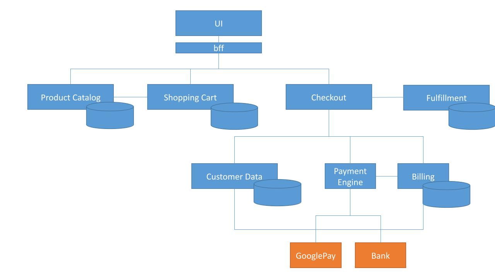
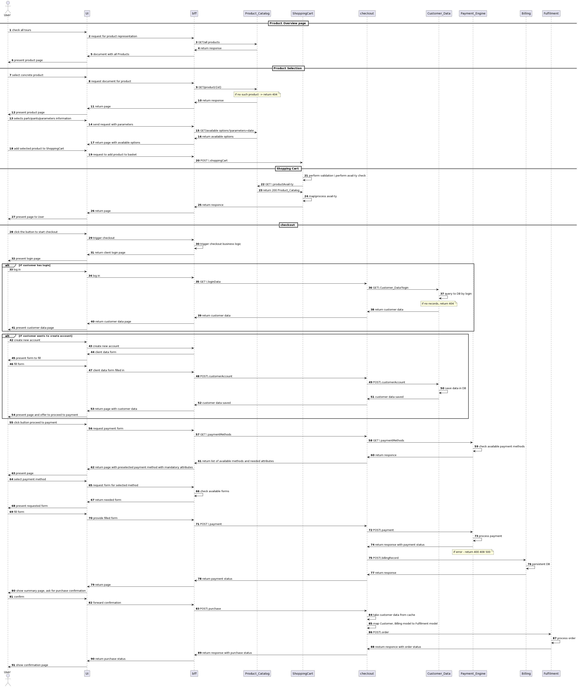
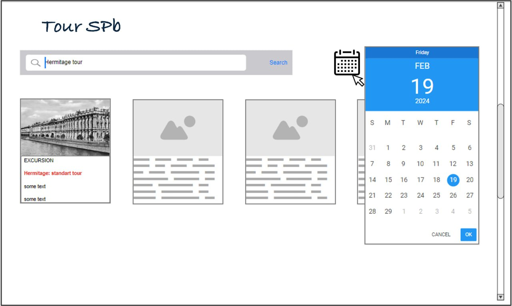

= TourSpb Specification
:toc:

== General description

Hi together,

welcome to the TourSpb application description.

Below you will find the general
description of the application with the following points:

* architecture overview including components description
* overall workflow of how the user interacts with the application
* key requirements including useCase description

The application covers the whole process of purchasing the tours from the
step of booking the concrete tour to payment and processing the order
from the fulfilment prospective.

== Architecture

=== Services description

.TourSpb architecture

External components are not under TourSPb responsibility

.Table of services
[cols="1,1,1"]
|===
|Service|Short description|External/Internal
|Product_Catalog|Component responsible for keeping the product data like the excursions
and all belonging information
|External

|UI| Component responsible for interacting with user|Internal

|bff| Component responsible for the orchestration of purchasing process
and interacting with UI|Internal

|shopping Cart| Component responsible for processing of temporary product selection and
validation, price calculation, persisting data storing| External

|Checkout| Component responsible for (orhecstration of the) processing of customer data
and payment data| External

|Customer Data| Component responsible for customer data management| External

|Payment Engine| Component responsible for enabling payment| External

|Billing| Component responsible for keeping payment info| External

|Fulfilment| Component responsible for processing the order

|===

== Business flow

=== Sequence diagram

.Overall flow for TourSpb

=== Description

== Requirements to TourSpb

Please, note, here are presented only a few examples of User Stories
as a part of my portfolio to give a brief understanding of the style
and granularity I used to cover in USs. But of course, the content
and format may vary depending on the team DoR criteria and
preferences.

=== User stories

==== User story 1: Checking for available tours

*Business scope*

As a user I want to see all products available for the date so that I can select a  concrete product.

*Acceptance criteria*

* Calendar pops up on the product overview page
* User is able to choose date from the calendar
* Products are checked for availability for the date
* After Product_Catalog check, page with available products is shown to the user
* Error behavior is covered

*Description*

The mockup is presented below the scenarios

_Scenario 1: Success case_

GIVEN: start page and calendar module are implemented +
WHEN: user chooses the date in the calendar +
THEN: all available products are requested +
THEN: bff sends GET\products?date = “date” request to Product-Catalog +
THEN: Product_Catalog returns response to bff +
THEN: all products available for the date are presented on UI +

_Scenario 2: Wrong date_

GIVEN: start page and calendar module are implemented +
WHEN: user chooses the date in the calendar +
IF: selected date < date now +
THEN: error message “sorry, selected date is in the past” is shown +

_Scenario 3: Technical error_

GIVEN: start page and calendar module are implemented +
WHEN: user chooses the date in the calendar +
THEN: all available products are requested +
THEN: bff sends GET\products?date = “date” request to Product-Catalog +
IF: Product_Catalog responds with technical error (401, 403, 5**) +
THEN: error message “Sorry, something went wrong. Please, try later” is shown +

_Scenario 4: Not found_

GIVEN: start page and calendar module are implemented +
WHEN: user chooses the date in the calendar +
THEN: all available products are requested +
THEN: bff sends GET\products?date = “date” request to Product-Catalog +
IF: Product_Catalog responds with 404 +
THEN: error message “Sorry, no products found for the date” is shown

.Mockup 1: Product catalog pages

==== User story 2: Checking product availability for adding to Shopping cart

*Business scope*

As a user I want to see the selected product parameters
so that I can check if the products can be added to the shopping cart.

*Acceptance criteria*

* All data related to selected product is presented after choosing all parameters (numberOfGuests, language, date)
* After the data is entered, GET/availableOptions?parameters request is sent to ProductCatalog, where parameters are set to the given by user.
* The returned response is processed: if 200 - “add to cart” button should become available, if 4\\** / 5** - button is disabled

*Description*

_Scenario 1: Error case_

GIVEN: form to fill in tour parameters is available +
WHEN: user fills in data +
THEN: GET/availableOptions?parameters request is sent to ProductCatalog +
THEN: Product-Catalog returns response +
IF: Product_Catalog responds with 200 http code and response is empty +
OR IF: Product_Catalog responds with 4\\** / 5** +
THEN: "add to cart" button is disabled +

